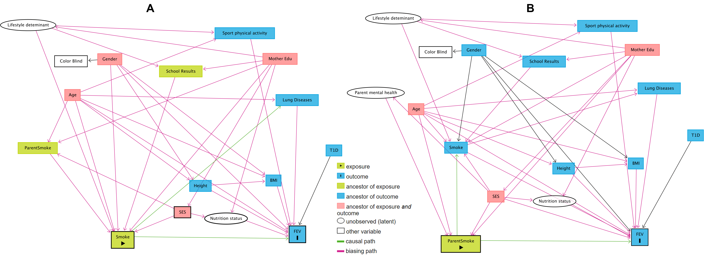

```{r setup, include = FALSE}
knitr::opts_chunk$set(echo = FALSE, warning = FALSE, message = FALSE)
```

\pagebreak

# Introduction

Smoking is known to have a negative effect on the overall health, particularly on the lungs. It causes damage to many of the body’s organs and systems. A person who smokes throughout their life is at high risk of developing a range of potentially lethal diseases. Passive smoking has been associated with respiratory infections and symptoms in infants and young children (Pedreira et al., 1985). Parental smoking has also been associated with decreased pulmonary function and lung growth in children (Weiss et al., 1980; Ware et al., 1984). The respiratory effects of passive smoking may be mediated by other factors to which children of smokers may be exposed, such as infection (Golding and Butler, 1984), allergy (Schilling et al., 1977), stress (Golding, 1984) or neonatal respiratory problems (Vedal et al., 1984). 
This study focused on the effect of smoking on the pulmonary function among children aged 3 to 19 years. The pulmonary function is measured as the FEV (Forced Expiratory Volume), which is the volume of air an individual can exhale in the first second of a forceful breath (measured in liters). The larger the FEV, the better the pulmonary function of the lungs.

The main objective of this study is to assess the effect of smoking on the FEV of children aged 3 to 19 years. The secondary objective is to assess the effect of parental smoking (passive smoking) on the FEV of the children.

# Methods

## Study Design

This study is the cross-sectional subset of a longitudinal observational survey among East Boston area families (USA) (Tager et al., 1979). Only one child per family was included in the study. The proposed number of children in the study was 654 children. 

## Variables of Interest

**_Outcome_**

The outcome of this study is the pulmonary function of the child, measured as the FEV (in liters), which is the volume of air an individual can exhale in the first second of a forceful breath.

**_Exposures_**

This study includes two exposure variables according to two research objectives. The first exposure is the smoking status of the child, which is the binary variable (non-smoker/smoker). The secondary exposure variable is the smoking status of the parents (non-smoker/smoker).

**_Potential Covariates_**

Potential covariates include age of the child (year), gender (male/female), height (m), BMI (kg/m^2^), social-economic status (SES) of the family (low/middle/high), physical activity (average number of hours per week of sports activities and average number of days of sports activities per week in previous year), school results of previous school year (poor/average/good), type I diabetes (yes/no), colorblind (yes/no), lung disease of the child (yes/no), and the mother education (secondary school/high school/university).


## Identifying the Set of Confounders

The set of confounders were selected based on the Directed Acyclic Graphs (DAG) (Shrier et al., 2008), which is the conceptual diagram representing causal relationships of all variables in the network. Based on DAGs, the set of confounders needed to block all confounding paths of the relationship between exposure and outcome, will be obtained. Thus, providing unbiased estimates of the relationship of interest. We constructed the DAG for the primary and secondary analysis separately. The DAGs are shown in Figure 1.



Figure 1. The causal diagrams for relationships between smoking/parental smoking and FEV of children

\textit{ \scriptsize \textbf{A}: DAG for the relationship between smoking status and FEV of children. A set of confounders  include age, gender, sport  activity of the child (average hours per week over previous year), mother education, and household SES; \textbf{B}: DAG for the relationship between parental smoking status and FEV of children.  A set of confounders  include age of the child, mother education, and household SES.}

## Statistical Analysis

### Descriptive Statistics

Descriptive statistics were used to summarize the data, with frequency analysis to describe categorical variables, means (standard deviations - SD) to describe continuous variables which are normally distributed and medians (interquartile range - IQR)  for skewed distributed continuous variables. The histogram was used to check the marginal normal distribution of the continuous variables. The percentage of missing values was also described. The descriptive statistics were conducted for the overall sample and by groups (smoking status and parental smoking status). Typos and unrealistic values were checked;  unrealistic values were excluded from the analysis.


### Handling of Missing Data

We used the margin plot as a basic visualization method to explore the patterns of missing values. The complete case method was applied to deal with missing values.

### Effects of Smoking and Parental Smoking on the FEV of Children

The multiple linear regressions was used to assess the effect of smoking and effect of parental smoking on the FEV of the children. Two models were fitted to address the study objectives.

The results of the regression models were reported with parameter estimates, 95% confidence interval (95%CI), and associated p-values. The two-sided hypotheses for the parameter estimates were tested using t-statistics. Unadjusted estimates were also produced for comparison. 

<br>


**_Effects of smoking status on the FEV of children_**

To address the primary objective, a multiple linear regression model was fitted adjusting for the set of confounders included in model one were age, gender, sport activities of children, mother education, and household SES identified by DAGs. The model formula can be written as:

\begin{equation}
Y_{i}=\beta_{0}+\beta_{1}x_{1i}+\beta_{2}x_{2i}+\beta_{3}x_{3i}+\beta_{4}x_{4i}+\beta_{5}x_{5i}+\beta_{6}x_{6i} +\varepsilon_{i} ; \\\\\ i=1,2,...,n
\end{equation}


To further investigate the effect of smoking on FEV among children, we consider the interaction between smoking status and gender as presented in model (2):

\begin{equation}
Y_{i}=\beta_{0}+\beta_{1}x_{1i}+\beta_{2}x_{2i}+\beta_{3}x_{3i}+\beta_{4}x_{4i}+\beta_{5}x_{5i}+\beta_{6}x_{6i} + \beta_{7}x_{1i}x_{3i} +\varepsilon_{i} ; \\\\\ i=1,2,...,n 
\end{equation}

where:


$Y_{i}$ is the i observation of response variable.

$x_{1i}$ is smoking status of the child

$x_{2i}$ is the age of the child 

$x_{3i}$ is the gender of the child

$x_{4i}$ is sport activities (average sport activities per week in hour) of the child

$x_{5i}$ is mother's educational level

$x_{6i}$ is household SES

$x_{7i}$ is the interaction between smoking status and gender 

$\beta_{0},\beta_{1},\beta_{2},...,\beta_{7}$ are coefficients of regression

$\varepsilon_{i} \stackrel{i.i.d}{\sim} N(0, \sigma^2)$

$n$ is the sample size of the dataset


**_Effects of parental smoking on the FEV of children_**

To address the secondary objective, a multiple linear regression model was fitted adjusting for the set of confounders included in this model were age, mother education and the household SES identified by DAGs. No interaction term was considered in the model for the effect of parental smoking on the FEV of children.

The model formula can be written as:


\begin{equation}
Y_{i}=\beta_{0}+\beta_{1}x_{1i}+\beta_{2}x_{2i}+\beta_{3}x_{3i}+\beta_{4}x_{4i} +\varepsilon_{i} ; \\\\\ i=1,2,...,n
\end{equation}

where:

$Y_{i}$ is the i observation of response variable.

$x_{1i}$ is the parental smoking status

$x_{2i}$ is the age of the child 

$x_{3i}$ is the mother's education level

$x_{4i}$ is the SES

$\beta_{0},\beta_{1},\beta_{2},...,\beta_{4}$ are coefficients of regression

$\varepsilon_{i} \stackrel{i.i.d}{\sim} N(0, \sigma^2)$

$n$ is the sample size of the dataset


### Model Diagnostics

We checked the regression assumptions before drawing statistical conclusions from the analysis by visual inspection through the following diagnostic plots.

To investigate the normality assumption of error terms, normal probability plots (Q-Q plot) of the residuals were obtained. Normality of error terms is indicated by all the points lying fairly on a straight line. Next, a   scatter plot of the square root of standardized residuals and fitted values was produced to examine constancy of error variance. The constancy of error variance was indicated by no systematic pattern of points in the plot. Linearity was checked using residual versus regressors plot.

Outliers were checked using residual plot. Since the models included categorical regressors, the multi-collinearity was assessed using the Generalized Variance Inflation Factor (GVIF). To make GVIFs comparable across dimensions, the $GVIF^{(1/(2*DF))}$ criterium was used. The variables with $[GVIF^{(1/(2*DF))}]^2 > 10$ are considered to have multicollinearity and excluded from the models (Fox et al., 1992). The significant level was set at 5%.

All analyses were conducted using R version 4.1.2 (The R Foundation for Statistical Computing, Vienna, Austria). The DAGs was constructed using online software DAGitty, available at https://www.dagitty.net.


```{r}
# Load data
library(tidyverse)
library(magrittr)
library(mice)
library(VIM)
library(psych)
library(table1)
library(car)
```

# Results 


```{r}
# Loading the Data and Data Cleaning
df <- read.csv("Data/FullData_OC.csv", sep = ";", dec = ",") %>% as.tibble()
names(df)[1] <- "ID"
names(df)[6] <- "Height"
```

## Cleaning Process

### Checking Sample Size

The final sample size was `r  dim(df)[[1]]`, which is smaller than the sample size indicated in the study design by 15 observations.


### Checking for Typos and Unrealistic Value

```{r, results='hide'}
# Checking Typos for Character Variables
# First taking a look over the categorical variables to check for typos
table(df$SES)
table(df$SchoolResults)
table(df$ColorBlind)
table(df$MotherEdu)

# These are the adjustments:
# - In "SES" column changing "high","middle" and "low" into "High", "Middle" and "Low"
# - In "SchoolResults" column changing "poor","average" and "good" into "Poor", "Average" and "Good"
# - In "ColorBlind" column changing "no" and "yes" into "No" and "Yes"
# - In "MotherEdu" column changing "secondary school","high school" and "university" into "Secondary school", "High school" and "University"
```


```{r}
# Change character variables to factor variables
df %<>% mutate(SES = case_when(SES == "high" ~ "High",
                               SES == "middle" ~ "Middle",
                               SES == "low" ~ "Low",
                               TRUE ~ SES),
               SES = factor(SES, levels = c("Low", "Middle", "High")),
               SchoolResults = case_when(SchoolResults == "poor" ~ "Poor",
                                         SchoolResults == "average" ~ "Average",
                                         SchoolResults == "good" ~ "Good",
                                         TRUE ~ SchoolResults),
               SchoolResults = factor(SchoolResults, levels = c("Poor", "Average", "Good")),
               ColorBlind = case_when(ColorBlind == "no" ~ "No",
                                      ColorBlind == "yes" ~ "Yes",
                                      TRUE ~ ColorBlind),
               ColorBlind = factor(ColorBlind, levels = c("No", "Yes")),
               MotherEdu = case_when(MotherEdu == "secondary school" ~ "Secondary school",
                                     MotherEdu == "high school" ~ "High school",
                                     MotherEdu == "university" ~ "University",
                                     TRUE ~ MotherEdu),
               MotherEdu = factor(MotherEdu, levels = c("Secondary school", "High school", "University")))

```


```{r, results='hide'}
# Checking Unrealistic Values for Continuous Variables
# Histogram plot of the continuous variables to check for possible unrealistic values using this graphs
df %>% select(Age, FEV, Height, BMI, Sport, SportDays) %>%
  gather(key = "Variable", value = "Value") %>%
  ggplot(aes(x = Value, fill = Variable)) +
  geom_histogram(color = "white") + 
  facet_wrap(~Variable, scales = "free") +
  theme_minimal() ->> fig_dist1
# fig_dist1
```

```{r, results='hide'}
df$Height[df$Height < 0 | df$Height > 2] 
df$Height[df$Height == 150] <- NA
```


```{r, results='hide'}
# Histogram plot of the continuous variables after removing typos
df %>% select(Age, FEV, Height, BMI, Sport, SportDays) %>%
  gather(key = "Variable", value = "Value") %>%
  ggplot(aes(x = Value, fill = Variable)) +
  geom_histogram(color = "white") + 
  facet_wrap(~Variable, scales = "free") +
  theme_minimal() ->> fig_dist2
#fig_dist2
```

We found one value of 150m in height of a child. This value was changed into missing value.


## Descriptive Analysis

### Missing Values

```{r fig2, results='hide'}
aggr(df[-1], col = c('skyblue','red'),
     numbers = TRUE, sortVars = TRUE, labels = names(data), cex.axis = 0.7, gap = 3, 
     ylab = c("Histogram of missing data", "Pattern"))
```

$$\textrm{Figure 2: Missing value pattern of study variables}$$


The missing values appeared in five variables, including school results (11.9%), sport time (2.0%), sport day (2.0%), height (0.3%), and mother education (0.2%).

Regarding the pattern of missing values, 87.3% data without any missing values, 10.2% missing values on the school results only, 1.7% missing values happened among three variables, including school results, sport day, and sport time. Other patterns accounted for less than 1%. 


### Descriptive Statistics for Study Variables


```{r table1}
# These are the adjustments for binary values in the dataset:
# - In "Smoke" column changing 0 and 1 into "Non-smoker" and "Smoker"
# - In "ParentSmoke" column changing 0 and 1 into "Non-smoker" and "Smoker"
# - In "Gender" column changing 0 and 1 into "Female and "Male"
# - In "Smoke" column changing 0 and 1 into "No" and "Yes"

df2 <- df %>% mutate(Smoke = factor(Smoke, levels = c(0, 1), labels = c("Non-smoker", "Smoker")),
                     Gender = factor(Gender, levels = c(0, 1), labels = c("Female", "Male")),
                     ParentSmoke = factor(ParentSmoke, levels = c(0, 1), 
                                          labels = c("Non-smoker", "Smoker")),
                     T1D = factor(T1D, levels = c(0, 1), labels = c("No", "Yes")),
                     LungDisease = factor(LungDisease, levels = c(0, 1), labels = c("No", "Yes")))


units(df2$Height) <- "m"
units(df2$Age) <- "year"
units(df2$BMI) <- "kg/m2"
units(df2$Sport) <- "hour"

# Set up template for tables
rndr <- function(x, name, ...) {
  if (!is.numeric(x)) return(render.default(x))
  what <- switch(name,
                 Age  = "Mean (SD)", 
                 FEV  = "Mean (SD)",
                 Height  = "Mean (SD)",
                 BMI  = "Mean (SD)",
                 Sport = "Median [Q1, Q3]")
  parse.abbrev.render.code(c("", what))(x)
}

#----- Table 1: Participant’s characteristics
strata <- c(split(df2, df2$Smoke), split(df2, df2$ParentSmoke), list(Total = df2))

labels <- list(
  variables = list(FEV = "FEV (liter)",
                   Age = "Age (year)",
                   Gender = "Gender",
                   Height = "Height (m)",
                   BMI = "BMI (kg/m2)",
                   Sport = "Sport time per week (hour)",
                   SchoolResults = "Scool Results",
                   T1D = "T1D",
                   ColorBlind = "Color Blind",
                   LungDisease = "Lung Diseases",
                   SES = "Household SES",
                   ParentSmoke = "Parental smoking",
                   MotherEdu = "Mother education"),
  groups = list("Smoking", "Parental Smoking", " "))

table1 <- table1(strata, labels, groupspan = c(2, 2, 1), render = rndr, caption = "Descriptive statistics for study variables")
t1kable(table1, booktabs = TRUE)
```

Table \@ref(tab:table1) shows the descriptive statistics for study variables. The means FEV of children were 3.28 (SD = 0.75) and 2.53 (SD = 0.82) liters among the smoking and non-smoking group, respectively. The figures for children whose parents were smokers and non-smokers were 2.77 (SD = 0.93) and 2.57 (SD = 0.82) liters, respectively. The proportion of children who were smokers was 10.2%, and 18.0% of the children had parents who were smokers.

The mean age of children was 9.8 years (SD = 2.9), with a half was female (48.8%). Most of children were from high SES households (73.9%), had mother who completed university (65.6%). Only 5.8% and 5.3% of children had color blind and lung diseases respectively. Nearly a half of students had school results of average (41.6%). The median number of hours per week children spent for sport activities was 2.00 (IQR: 1 - 3) hours.


## Effect of Smoking on FEV of Children

```{r}
df_complete <- df %>% select(FEV, Smoke, ParentSmoke, Age, Gender, MotherEdu, Sport, SES) %>% na.omit()
```

Based on DAGs, the set of confounders of the model for the effects of smoking on FEV of children were age, gender, mother education, sport, and household SES.

We applied the complete-case method to deal with missing values in the variables of interest. The complete-case data included `r dim(df_complete)[1]` observations. This complete-case data were also used for the model of [Effect of Parental Smoking on FEV of Children].


### Model Assumptions

The model assumptions includes linearity of the outcome and regressors, normality and homoscedasticity of residuals.
We based on the plot of residuals versus regressors to evaluate the linearity and homoscedasticity assumptions, and the QQ-plot to assess the normality of the residuals. The model assumptions were satisfied since there were no systematic deviation from the residuals plots although, we observed small deviation at the extreme end of the QQ-plot of normality assumption checking. The details on model assumptions assessment are provided in the [Appendix].


### Multicollinearity and Outlier Checking

```{r vif1}
# Unadjusted model
m1_0 <- lm(FEV ~ Smoke, data = df_complete)
# summary(m1_0)

# Adjusted model
m1_1 <- lm(FEV ~ Smoke + Age + Gender + MotherEdu + Sport + SES, data = df_complete)

# Print out VIF
cbind(vif(m1_1), `[GVIF^(1/(2*Df))]^2` = (vif(m1_1)[, 3])^2) %>% as.tibble(rownames= "Variable") %>% mutate_at(-1, function(x){round(x, 2)}) %>% knitr::kable(caption = "Multicollinearity checking for model of smoking and FEV of children", booktabs = TRUE)
```

Table \@ref(tab:vif1) describes the $GVIF$ and $[GVIF^{(1/(2*Df))}]^2$ estimates for variables from the model of smoking on FEV of children. Since the value of $[GVIF^{(1/(2*Df))}]^2$ for all variables were less than 10, we found no multicollinearity issues of the model.

Regarding outlier, we found no significant outliers based on the residuals versus regressor plots. The details on outliers checking are provided in the [Appendix].


### Interpretation of the Model Estimates for Primary Reseach Question

In unadjusted model, we found that the mean FEV of children who were smokers was larger by 0.72 (95%CI: 0.51 to 0.93) liters as compared to children who were not smokers. However, this result was not controlled for confounders. Details of unadjusted model is showed in the [Appendix].


Table \@ref(tab:table2) provides the results of the model for the effects of smoking on FEV of children. The model was adjusted for set of confounders, including age, gender, mother education, sport, and SES.

```{r table2}
cbind(summary(m1_1)$coefficients, confint(m1_1)) %>% as.tibble(rownames= "Variable") %>% mutate_at(-1, function(x){round(x, 3)}) %>% knitr::kable(caption = "Effect of smoking on FEV of children", booktabs = TRUE)
```

Conditioning on gender, sport activities, mother education, and household SES, the mean FEV of children who were smokers was smaller by 0.05 liters (95%CI: -0.45 to 0.35) as compared to children who were not smokers. However, the effect was not statistically significant, with p-value = 0.796. Thus, there was insufficient evidence to conclude effect of smoking on FEV of children.


### Further Investigation of the Effect of Smoking on FEV of Children

We investigated the gender difference in the effect of smoking on FEV of children by including the interaction between smoking status and gender of children. Since the interaction term showed significant effect, we kept it in the model. Table \@ref(tab:table3) presents the model of the effect of smoking on FEV of children with smoking status and gender interaction.


```{r table3}
m1_2 <- lm(FEV ~ Smoke*Gender + Age  + MotherEdu + Sport + SES, data = df_complete)

cbind(summary(m1_2)$coefficients, confint(m1_2)) %>% as.tibble(rownames= "Variable") %>% mutate_at(-1, function(x){round(x, 3)}) %>%  knitr::kable(caption = "Effect of smoking on FEV of children with interaction of smoking and gender", booktabs = TRUE)
```

The effect of smoking on FEV in males was higher by 0.30 liters (95%CI: 0.03 to 0.58) than that of females. This result was significant with p-value = 0.031.

Together, after controlling for confounders, we found no effect of smoking on FEV of children. However, the pattern of the effect was different between males and females.


## Effect of Parental Smoking on FEV of Children

Based on DAGs, the set of confounders of the model for the effects of parental smoking on FEV of children were age of children, mother education, and household SES.

### Model Assumptions

The model assumptions includes linearity of the outcome and regressors, normality and homoscedasticity of residuals.
The model assumptions were satisfied since there were no systematic deviation from the residuals plots although, we observed small deviation at the extreme end of the QQ-plot of normality assumption checking. The details on model assumptions assessment are provided in the [Appendix].


### Multicollinearity and Outlier Checking

```{r vif2}
# Unadjusted model
m2_0 <- lm(FEV ~ ParentSmoke, data = df_complete)
# summary(m2_0)

# Adjusted model
m2_1 <- lm(FEV ~ ParentSmoke + Age + MotherEdu + SES, data = df_complete)

# Print out VIF
cbind(vif(m2_1), `[GVIF^(1/(2*Df))]^2` = (vif(m2_1)[, 3])^2) %>% as.tibble(rownames= "Variable") %>% mutate_at(-1, function(x){round(x, 2)}) %>% knitr::kable(caption = "Multicollinearity checking for model of parental smoking and FEV of children", booktabs = TRUE)
```

Table \@ref(tab:vif2) describes the $GVIF$ and $[GVIF^{(1/(2*Df))}]^2$ estimates for variables from the model of effect of parental smoking on FEV of children. The value of $[GVIF^{(1/(2*Df))}]^2$ ranging from 1.13 to 3.36, which were less than than 10, thus, no multicollinearity issues of the model were found.

Regarding outliers, no significant outliers were found based on the residuals versus regressor plots. The details on outliers checking are provided in the [Appendix].


### Interpretation of the Model Estimates for Secondary Reseach Question


```{r table4}
cbind(summary(m2_1)$coefficients, confint(m2_1)) %>% as.tibble(rownames= "Variable") %>% mutate_at(-1, function(x){round(x, 3)}) %>% knitr::kable(caption = "Effect of parental smoking on FEV of children", booktabs = TRUE)
```

In unadjusted model, we found that the mean FEV of children, whose parents were smokers, was larger by 0.21 liters (95%CI: 0.04 to 0.38) as compared to children whose parents were not smokers. However, this result was not controlled for confounders. Details of unadjusted model is showed in the [Appendix].

Table \@ref(tab:table4) provides the results of the model for the effects of parental smoking on FEV of children. The model was adjusted for set of confounders, including age of children, mother education, and household SES. 

Conditioning on age, mother education, and household SES. Children whose parents were smokers had lower mean FEV of 0.02 (95% CI: -0.14 to 0.10) liters as compared to children whose parents were non-smokers. However, the effect was not significant with p-value = 0.738. In other word, there was insufficient evidence to conclude the effect of parental smoking on the FEV of children.


# Discussion


In this study, we examined the effect of smoking and parental smoking on the FEV of children aged from 3 to 19 years. We found the prevalence of smoking among children was 10.2% and prevalence of parental smoking was 18.0%. We found no significant effects of smoking status of the children and the smoking status of their parents on the FEV. These results are similar with those of Wang and colleagues (Wang et al., 1994). 

However, the findings of our study are different from the study of Tager et al., (Tager et al., 1985), where effects of smoking on pulmonary lung function were found. In particular, children who began to smoke at 15 years of age and onwards, would affect a proportion of their FEV. These results contradict the results of our study, which might be due to the age of participants in Tager et al study is older than that of our study, therefore, the level of smoking exposure are different from our study participants.

Furthermore, our results reveal that the effect of smoking on the FEV is not the same in male as compare to female. This finding is comparable with those of Gold et al., (Gold et al., 1996) which stipulated that adolescent girls may be more vulnerable than boys. Gold et al. also found that differences exist in respiratory illness prevalence among gender for children aged 7 to 14 years (Gold et al., 1996).

Regarding the effect of parental smoking on FEV of children. Our findings were in line with the study of Bek and colleagues (Bek et al., 1999), which demonstrated that maternal smoking did not have significant effects on children’s pulmonary function.

In contrast, Bhargava and Khaliq (Bhargava and Khaliq, 2008) found that FEV was significantly lower in the children exposed to paternal smoking as compared to non-smokers. The differences might be explained by the difference in the study population. In fact, the study of Bhargava and Khaliq was conducted among children aged 12-18 years, thus, they might expose to the passive smoking differently from our study participants.

**_Limitations_**

The findings of this study should be interpreted in the context of potential limitations. First, the children in this study were from one area in the United States, this might limit the generalization of the findings to other children living in other areas. Second, the data of this study were from a cross-sectional study, thus the causal inference of smoking and FEV could not be confirmed. Besides, the FEV was measured in a single point of time, the FEV changes according to the level of smoking, therefore, was not obtained. The longitudinal study is needed to evaluate the changes and long-term effects of smoking on FEV of children. Third, the information on levels of smoking and duration of smoking among children and their parents were not collected, that might affect the magnitude of the effects of smoking on FEV of children. Further studies should be conducted with better measurement method of smoking levels such as specific smoking survey scale and urinary levels of nicotine.


# Conclusion

The effects of smoking and non-smoking on FEV of children were negligible in this study. Longitudinal studies should be conducted to evaluate changes and the long-term effects of smoking and passive smoking on the pulmonary function of children. The gender differences in responses to smoking also should be further researched.

\pagebreak

# References {-}

Pedreira FA, Guandolo VL, Feroli EJ, Mella GW, Weiss IP: Involuntary smokingand the incidence of respiratory illness during the first year of life.  Pediatrics 1985; 75:594-597.

Weiss ST, Tager JB, Speizer FE, Rosner B: Persistent wheeze:  Its relation to respi-ratory illness, cigarette smoking, and level of pulmonary function in a population sampleof children.  Am Rev Respir Dis 1980; 122:697-707.

Ware  JH,  Dockery  DW,  Spiro  A,  Speizer  FE,  Ferris  BG:  Passive  smoking,  gascooking, and respiratory heatlh of children living in six cities.  Am Rev Respir Dis 1984;129:366-374.

Golding J, Butler NR: Wheezing and stress?  In:  Butler NR, Corner BD (eds):  Stressand Disability in Childhood.  Bristol:  Wright, 1984; 87-99.

SSchilling RSF, Letai AD, Hui SL, Beck GJ, Schoenberg JB, Bouhuys AH: Lung function,respiratory disease,  and smoking in families.  Am J Epidemiol 1977;  106:274-283.:  Lungfunction, respiratory disease, and smoking in families.  Am J Epidemiol 1977; 106:274-283.

Golding J: Britain’s national cohort studies.  In:  Macfarlane JA (ed):  Progress in ChildHealth, V. 1.  New York:  Churchill Livingstone, 1984; 178-186.

Vedal S, Schenker MB, Samet JM, Speizer FE: Risk factors for childhood respiratorydisease:  Analysis of pulmonary function.  Am Rev Respir Dis 1984; 130:187-192.

Tager, I., Weiss, S., Rosner, B., and Speizer, F. (1979). Effect of Parental Cigarette Smoking on the Pulmonary Function of Children, American Journal of Epidemiology, 110(1), 15-26.

Shrier, I., & Platt, R. W. (2008). Reducing bias through directed acyclic graphs. BMC Medical Research Methodology, 8(1), 70.

Fox, John, and Georges Monette. 1992. Generalized Collinearity Diagnostics. Journal of the American Statistical Association 87 (417): 178–83.

R  Core  Team  (2021).   R:  A  language  and  environment  for  statistical  computing.   RFoundation for Statistical Computing, Vienna, Austria.  URL https://www.R-project.org/

Wang X, Wypij D, Gold DR, Speizer FE, Ware JH, Ferris BG Jr, Dockery DW. A longitudinal study of the effects of parental smoking on pulmonary function in children 6-18 years. Am J Respir Crit Care Med. 1994 Jun;149(6):1420-5.

Tager IB, Muñoz A, Rosner B, Weiss ST, Carey V, Speizer FE. Effect of cigarette smoking on the pulmonary function of children and adolescents. Am Rev Respir Dis. 1985 May;131(5):752-9. 


Gold DR, Wang X, Wypij D, Speizer FE, Ware JH, Dockery DW. Effects of cigarette smoking on lung function in adolescent boys and girls. N Engl J Med. 1996 Sep 26;335(13):931-7.


Bek K, Tomaç N, Delibas A, Tuna F, Teziç HT, Sungur M. The effect of passive smoking on pulmonary function during childhood. Postgrad Med J. 1999 Jun;75(884):339-41. 

Bhargava EK, Khaliq F. Effect of paternal smoking on the pulmonary functions of adolescent males. Indian J Physiol Pharmacol. 2008 Oct-Dec;52(4):413-9.


\pagebreak

# Appendix {-}

## Unadjusted Models {-}

**Appendix Table 1: Unadjusted model for effect of smoking on FEV of children**

```{r table5}
apx_tab1 <- cbind(summary(m1_0)$coefficients, confint(m1_0)) %>% 
  as.tibble(rownames= "Variable") %>% 
  mutate_at(-1, function(x){round(x, 3)}) %>% 
  mutate(`Pr(>|t|)` = as.character(`Pr(>|t|)`))

apx_tab1[[1, 5]] <- "<0.001"
apx_tab1[[2, 5]] <- "<0.001"
apx_tab1 %>% knitr::kable(booktabs = TRUE)
```
   


**Appendix Table 2: Unadjusted model for effect of parental smoking on FEV of children**

```{r table6}
cbind(summary(m2_0)$coefficients, confint(m2_0)) %>% 
  as.tibble(rownames= "Variable") %>% 
  mutate_at(-1, function(x){round(x, 3)}) %>% 
  knitr::kable(booktabs = TRUE)
```

\pagebreak


## Model Diagnostics {-}


```{r fig3, fig.fullwidth = TRUE, fig.height = 9, fig.width = 8}
par(mfrow = c(3, 3))

boxplot(m1_1$residuals ~ df_complete$Smoke , xlab = "Smoking" , ylab="residuals", line=0)
abline(h = 0, lty = 2, col = 4)

boxplot(m1_1$residuals ~ df_complete$Gender , xlab = "Gender" , ylab="residuals", line=0)
abline(h = 0, lty = 2, col = 4)

boxplot(m1_1$residuals ~ df_complete$MotherEdu , xlab = "Mother Education" , ylab="residuals" , line=0)
abline(h = 0, lty = 2, col = 4)

boxplot(m1_1$residuals ~ df_complete$ParentSmoke, xlab = "Parental Smoking" , ylab="residuals")
abline(h = 0, lty = 2, col = 4)

boxplot(m1_1$residuals ~ df_complete$SES, xlab = "SES" , ylab="residuals")
abline(h = 0, lty = 2, col = 4)

plot(m1_1$residuals ~ df_complete$Age, xlab = "Age" , ylab="residuals")
abline(h = 0, lty = 2, col = 4)

plot(m1_1$residuals ~ m1_1$fitted.values, xlab = "fitted plot" , ylab="residuals" , main = "Residual vs fitted plot")
abline(h = 0, lty = 2, col = 4)

plot(df_complete$FEV ~ m1_1$fitted.values, xlab = "fitted plot" , ylab="FEV" , main = "Response variable vs fitted plot")
abline(h = 0, lty = 2, col = 4)


qqnorm(m1_1$residuals,xlab = "" , ylab="" )
qqline(m1_1$residuals)
```

Appendix Figure 1: Diagnostics plots of model for effect of smoking on FEV of children

\pagebreak


```{r fig4, fig.fullwidth = TRUE, fig.height = 9, fig.width = 8}
par(mfrow = c(3, 3))

boxplot(m1_2$residuals ~ df_complete$Smoke , xlab = "Smoking" , ylab="residuals", line=0)
abline(h = 0, lty = 2, col = 4)

boxplot(m1_2$residuals ~ df_complete$MotherEdu , xlab = "Mother Education" , ylab="residuals", line=0)
abline(h = 0, lty = 2, col = 4)

boxplot(m1_2$residuals ~ df_complete$ParentSmoke, xlab = "Parental Smoking" , ylab="residuals")
abline(h = 0, lty = 2, col = 4)

boxplot(m1_2$residuals ~ df_complete$SES, xlab = "SES" , ylab="residuals")
abline(h = 0, lty = 2, col = 4)

plot(m1_2$residuals ~ df_complete$Age, xlab = "Age" , ylab="residuals")
abline(h = 0, lty = 2, col = 4)

boxplot(m1_2$residuals ~ df_complete$Smoke*df_complete$Gender, xlab = "Smoke*Gender" , ylab="residuals")
abline(h = 0, lty = 2, col = 4)

plot(m1_2$residuals ~ m1_2$fitted.values, xlab = "fitted plot" , ylab="residuals" , main = "Residual vs fitted plot")
abline(h = 0, lty = 2, col = 4)

plot(df_complete$FEV ~ m1_2$fitted.values, xlab = "fitted plot" , ylab="FEV" , main = "Response variable vs fitted plot")
abline(h = 0, lty = 2, col = 4)


qqnorm(m1_2$residuals,xlab = "" , ylab="" )
qqline(m1_2$residuals)
```

Appendix Figure 2: Diagnostics plots of model for effect of smoking on FEV of children with interaction of smoking and gender

\pagebreak

```{r fig5, fig.fullwidth = TRUE, fig.height = 9, fig.width = 8}
par(mfrow = c(3, 3))

boxplot(m2_1$residuals ~ df_complete$ParentSmoke, xlab = "Parental Smoking" , ylab="residuals")
abline(h = 0, lty = 2, col = 4)

boxplot(m2_1$residuals ~ df_complete$MotherEdu , xlab = "Mother Education" , ylab="residuals", line=0)
abline(h = 0, lty = 2, col = 4)

boxplot(m2_1$residuals ~ df_complete$SES, xlab = "SES" , ylab="residuals")
abline(h = 0, lty = 2, col = 4)

plot(m2_1$residuals ~ df_complete$Age, xlab = "Age" , ylab="residuals")
abline(h = 0, lty = 2, col = 4)

plot(m2_1$residuals ~ m2_1$fitted.values, xlab = "fitted plot" , ylab="residuals" , main = "Residual vs fitted plot")
abline(h = 0, lty = 2, col = 4)

plot(df_complete$FEV ~ m2_1$fitted.values, xlab = "fitted plot" , ylab="FEV" , main = "Response variable vs fitted plot")
abline(h = 0, lty = 2, col = 4)

qqnorm(m2_1$residuals,xlab = "" , ylab="" )
qqline(m2_1$residuals)
```


Appendix Figure 3: Diagnostics plots of model for effect of parental smoking on FEV of children

Appendix Figure 1, 2, and 3 show the model diagnostics plots for model assumptions corresponding to the three models used in this study. We based on the following model assumptions including linearity and normality of the residuals, and homoscedasticity.

**Linearity assumption**: The linearity assumption of the residuals was evaluated using residual versus the regressors plot, and residual versus fitted values plot. The plots of the residuals versus the regressors and fitted values show no serious deviation from the zero central line. This indicates that the linearity assumption is satisfied. 

**Normality assumption**: The normality of the residuals was assessed using the QQ-plots. The plots performed suggests no serious deviation from the reference line, except some points in the extreme ends. This shows that the assumption of normality of the residues was not violated.

**Homoscedasticity**: The constant of the error variance was assessed using the residual versus the regressors plots. We observe as the regressor points increase, there is a constant distribution of the residuals hence showing constant error variance. This shows that the assumption of constant error variance is satisfied. 


## Outlier Checking {-}


Regarding outliers, we applied the residuals versus fitted values plots to determine the outliers. According to the plots, we found no unusual observations. The unusual observations are termed to be outliers if they are extreme, relative to other residuals. (Appendix Figure 1, 2, and 3)


## R Code {-}

```
#-------------------------------------------------------------------------------
#                               Project: Learning from Data
#                                       Final Report
# Effect of Smoking on the Pulmonary Function Among Children Aged 3 To 19 Years: 
#                                A Cross-Sectional Study
#-------------------------------------------------------------------------------


# Load library
library(tidyverse)
library(magrittr)
library(mice)
library(VIM)
library(psych)
library(table1)
library(car)

#-------------------------------------------------------------------------------
#----- Loading the Data and Data Cleaning

df <- read.csv("Data/FullData_OC.csv", sep = ";", dec = ",") %>% as.tibble()
names(df)[1] <- "ID"
names(df)[6] <- "Height"


#----- Checking Typos for Character Variables
# First taking a look over the categorical variables to check for typos

table(df$SES)
table(df$SchoolResults)
table(df$ColorBlind)
table(df$MotherEdu)

# These are the adjustments:
# - In "SES" column changing "high","middle" and "low" into "High", "Middle" and "Low"
# - In "SchoolResults" column changing "poor","average" and "good" into "Poor", 
# "Average" and "Good"
# - In "ColorBlind" column changing "no" and "yes" into "No" and "Yes"
# - In "MotherEdu" column changing "secondary school","high school" and "university" into
# "Secondary school", "High school" and "University"

#----- Change character variables to factor variables

df %<>% mutate(SES = case_when(SES == "high" ~ "High",
                               SES == "middle" ~ "Middle",
                               SES == "low" ~ "Low",
                               TRUE ~ SES),
               SES = factor(SES, levels = c("Low", "Middle", "High")),
               SchoolResults = case_when(SchoolResults == "poor" ~ "Poor",
                                         SchoolResults == "average" ~ "Average",
                                         SchoolResults == "good" ~ "Good",
                                         TRUE ~ SchoolResults),
               SchoolResults = factor(SchoolResults, levels = c("Poor", "Average", "Good")),
               ColorBlind = case_when(ColorBlind == "no" ~ "No",
                                      ColorBlind == "yes" ~ "Yes",
                                      TRUE ~ ColorBlind),
               ColorBlind = factor(ColorBlind, levels = c("No", "Yes")),
               MotherEdu = case_when(MotherEdu == "secondary school" ~ "Secondary school",
                                     MotherEdu == "high school" ~ "High school",
                                     MotherEdu == "university" ~ "University",
                                     TRUE ~ MotherEdu),
               MotherEdu = factor(MotherEdu, levels = c("Secondary school", "High school",
               "University")))


#----- Checking Unrealistic Values for Continuous Variables
# Histogram plot of the continuous variables to check for possible unrealistic 
# values using this graphs

df %>% select(Age, FEV, Height, BMI, Sport, SportDays) %>%
  gather(key = "Variable", value = "Value") %>%
  ggplot(aes(x = Value, fill = Variable)) +
  geom_histogram(color = "white") + 
  facet_wrap(~Variable, scales = "free") +
  theme_minimal() ->> fig_dist1
fig_dist1

# Remove one typo for height
df$Height[df$Height < 0 | df$Height > 2] 
df$Height[df$Height == 150] <- NA

# Histogram plot of the continuous variables after removing typos
df %>% select(Age, FEV, Height, BMI, Sport, SportDays) %>%
  gather(key = "Variable", value = "Value") %>%
  ggplot(aes(x = Value, fill = Variable)) +
  geom_histogram(color = "white") + 
  facet_wrap(~Variable, scales = "free") +
  theme_minimal() ->> fig_dist2
fig_dist2

# According to the histogram, FEV, age, height, and BMI were normally distributed
# So mean and SD were used to describe these variables
# Sport activities time was not normally distributed so Median and IQR was used


#-------------------------------------------------------------------------------
#----- Descriptive Analysis
#----- Missing value

aggr(df[-1], col = c('skyblue','red'),
     numbers = TRUE, sortVars = TRUE, labels = names(data), cex.axis = 0.7, gap = 3, 
     ylab = c("Histogram of missing data", "Pattern"))


#----- Table 1: Descriptive statistics for study variables

# These are the adjustments for binary values in the dataset:
# - In "Smoke" column changing 0 and 1 into "Non-smoker" and "Smoker"
# - In "ParentSmoke" column changing 0 and 1 into "Non-smoker" and "Smoker"
# - In "Gender" column changing 0 and 1 into "Female and "Male"
# - In "Smoke" column changing 0 and 1 into "No" and "Yes"

df2 <- df %>% mutate(Smoke = factor(Smoke, levels = c(0, 1), labels = c("Non-smoker", "Smoker")),
                     Gender = factor(Gender, levels = c(0, 1), labels = c("Female", "Male")),
                     ParentSmoke = factor(ParentSmoke, levels = c(0, 1), 
                                          labels = c("Non-smoker", "Smoker")),
                     T1D = factor(T1D, levels = c(0, 1), labels = c("No", "Yes")),
                     LungDisease = factor(LungDisease, levels = c(0, 1), labels = c("No", "Yes")))


units(df2$Height) <- "m"
units(df2$Age) <- "year"
units(df2$BMI) <- "kg/m2"
units(df2$Sport) <- "hour"

# Set up template for tables
rndr <- function(x, name, ...) {
  if (!is.numeric(x)) return(render.default(x))
  what <- switch(name,
                 Age  = "Mean (SD)", 
                 FEV  = "Mean (SD)",
                 Height  = "Mean (SD)",
                 BMI  = "Mean (SD)",
                 Sport = "Median [Q1, Q3]")
  parse.abbrev.render.code(c("", what))(x)
}

#----- Table 1: Participant’s characteristics

strata <- c(split(df2, df2$Smoke), split(df2, df2$ParentSmoke), list(Total = df2))

labels <- list(
  variables = list(FEV = "FEV (liter)",
                   Age = "Age (year)",
                   Gender = "Gender",
                   Height = "Height (m)",
                   BMI = "BMI (kg/m2)",
                   Sport = "Sport time per week (hour)",
                   SchoolResults = "Scool Results",
                   T1D = "T1D",
                   ColorBlind = "Color Blind",
                   LungDisease = "Lung Diseases",
                   SES = "Household SES",
                   ParentSmoke = "Parental smoking",
                   MotherEdu = "Mother education"),
  groups = list("Smoking", "Parental Smoking", " "))

table1 <- table1(strata, labels, groupspan = c(2, 2, 1), render = rndr, 
caption = "Descriptive statistics for study variables")
t1kable(table1, booktabs = TRUE)

#-------------------------------------------------------------------------------
#----- Modelling
#----- Effect of Smoking on FEV of Children

#-- Get the complete-case dataset

df_complete <- df %>% select(FEV, Smoke, ParentSmoke, Age, Gender, MotherEdu, Sport, SES) %>% na.omit()

#-- Multicollinearity and Outlier Checking
# Unadjusted model

m1_0 <- lm(FEV ~ Smoke, data = df_complete)
# summary(m1_0)

# Adjusted model
m1_1 <- lm(FEV ~ Smoke + Age + Gender + MotherEdu + Sport + SES, data = df_complete)

#----- Table 2: Multicollinearity checking for model of smoking and FEV of children

cbind(vif(m1_1), `[GVIF^(1/(2*Df))]^2` = (vif(m1_1)[, 3])^2) %>% 
as.tibble(rownames= "Variable") %>% mutate_at(-1, function(x){round(x, 2)}) %>%
knitr::kable(
caption = "Multicollinearity checking for model of smoking and FEV of children", 
booktabs = TRUE)

#----- Table 3: Effect of smoking on FEV of children

cbind(summary(m1_1)$coefficients, confint(m1_1)) %>% 
as.tibble(rownames= "Variable") %>% 
mutate_at(-1, function(x){round(x, 3)}) %>% 
knitr::kable(caption = "Effect of smoking on FEV of children", booktabs = TRUE)

#----- Table 4: Effect of smoking on FEV of children with interaction of smoking and gender
# Including the interaction between smoking status and gender of children

m1_2 <- lm(FEV ~ Smoke*Gender + Age  + MotherEdu + Sport + SES, data = df_complete)

cbind(summary(m1_2)$coefficients, confint(m1_2)) %>% 
as.tibble(rownames= "Variable") %>% 
mutate_at(-1, function(x){round(x, 3)}) %>%  
knitr::kable(
caption = "Effect of smoking on FEV of children with interaction of smoking and gender",
booktabs = TRUE)


#-----  Effect of Parental Smoking on FEV of Children
#-- Multicollinearity and Outlier Checking

# Unadjusted model

m2_0 <- lm(FEV ~ ParentSmoke, data = df_complete)
# summary(m2_0)

# Adjusted model

m2_1 <- lm(FEV ~ ParentSmoke + Age + MotherEdu + SES, data = df_complete)

#----- Table 5: Multicollinearity checking for model of parental smoking and FEV of children

cbind(vif(m2_1), `[GVIF^(1/(2*Df))]^2` = (vif(m2_1)[, 3])^2) %>% 
as.tibble(rownames= "Variable") %>% 
mutate_at(-1, function(x){round(x, 2)}) %>% 
knitr::kable(
caption = "Multicollinearity checking for model of parental smoking and FEV of children",
booktabs = TRUE)

#----- Table 6: Effect of parental smoking on FEV of children

cbind(summary(m2_1)$coefficients, confint(m2_1)) %>% 
as.tibble(rownames= "Variable") %>% 
mutate_at(-1, function(x){round(x, 3)}) %>% 
knitr::kable(caption = "Effect of parental smoking on FEV of children", 
booktabs = TRUE)

#-------------------------------------------------------------------------------
#----- Appendix

#----- Unadjusted models

# Unadjusted model for effect of smoking on FEV of children

apx_tab1 <- cbind(summary(m1_0)$coefficients, confint(m1_0)) %>% 
  as.tibble(rownames= "Variable") %>% 
  mutate_at(-1, function(x){round(x, 3)}) %>% 
  mutate(`Pr(>|t|)` = as.character(`Pr(>|t|)`))

apx_tab1[[1, 5]] <- "<0.001"
apx_tab1[[2, 5]] <- "<0.001"
apx_tab1 %>% knitr::kable(booktabs = TRUE)


# Unadjusted model for effect of parental smoking on FEV of children

cbind(summary(m2_0)$coefficients, confint(m2_0)) %>% 
  as.tibble(rownames= "Variable") %>% 
  mutate_at(-1, function(x){round(x, 3)}) %>% 
  knitr::kable(
  caption = "Unadjusted model for effect of parental smoking on FEV of children", 
  booktabs = TRUE)


#----- Model Diagnostics

#----- Appendix Figure 1: Diagnostics plots of model for effect of smoking on FEV of children

par(mfrow = c(3, 3))

boxplot(m1_1$residuals ~ df_complete$Smoke , xlab = "Smoking" , 
ylab="residuals", line=0)
abline(h = 0, lty = 2, col = 4)

boxplot(m1_1$residuals ~ df_complete$Gender , xlab = "Gender" , 
ylab="residuals", line=0)
abline(h = 0, lty = 2, col = 4)

boxplot(m1_1$residuals ~ df_complete$MotherEdu , xlab = "Mother Education" ,
ylab="residuals" , line=0)
abline(h = 0, lty = 2, col = 4)

boxplot(m1_1$residuals ~ df_complete$ParentSmoke, xlab = "Parental Smoking" ,
ylab="residuals")
abline(h = 0, lty = 2, col = 4)

boxplot(m1_1$residuals ~ df_complete$SES, xlab = "SES" , ylab="residuals")
abline(h = 0, lty = 2, col = 4)

plot(m1_1$residuals ~ df_complete$Age, xlab = "Age" , ylab="residuals")
abline(h = 0, lty = 2, col = 4)

plot(m1_1$residuals ~ m1_1$fitted.values, xlab = "fitted plot" , 
ylab="residuals" , main = "Residual vs fitted plot")
abline(h = 0, lty = 2, col = 4)

plot(df_complete$FEV ~ m1_1$fitted.values, xlab = "fitted plot" , 
ylab="FEV" , main = "Response variable vs fitted plot")
abline(h = 0, lty = 2, col = 4)


qqnorm(m1_1$residuals,xlab = "" , ylab="" )
qqline(m1_1$residuals)

#----- Appendix Figure 2: Diagnostics plots of model for effect of smoking on FEV of children 
# with interaction of smoking and gender

par(mfrow = c(3, 3))

boxplot(m1_2$residuals ~ df_complete$Smoke , xlab = "Smoking" , 
ylab="residuals", line=0)
abline(h = 0, lty = 2, col = 4)

boxplot(m1_2$residuals ~ df_complete$MotherEdu , xlab = "Mother Education",
ylab="residuals", line=0)
abline(h = 0, lty = 2, col = 4)

boxplot(m1_2$residuals ~ df_complete$ParentSmoke, xlab = "Parental Smoking",
ylab="residuals")
abline(h = 0, lty = 2, col = 4)

boxplot(m1_2$residuals ~ df_complete$SES, xlab = "SES" , ylab="residuals")
abline(h = 0, lty = 2, col = 4)

plot(m1_2$residuals ~ df_complete$Age, xlab = "Age" , ylab="residuals")
abline(h = 0, lty = 2, col = 4)

boxplot(m1_2$residuals ~ df_complete$Smoke*df_complete$Gender, xlab = "Smoke*Gender",
ylab="residuals")
abline(h = 0, lty = 2, col = 4)

plot(m1_2$residuals ~ m1_2$fitted.values, xlab = "fitted plot" , ylab="residuals", 
main = "Residual vs fitted plot")
abline(h = 0, lty = 2, col = 4)

plot(df_complete$FEV ~ m1_2$fitted.values, xlab = "fitted plot" , ylab="FEV", 
main = "Response variable vs fitted plot")
abline(h = 0, lty = 2, col = 4)


qqnorm(m1_2$residuals,xlab = "" , ylab="" )
qqline(m1_2$residuals)

#----- Appendix Figure 3: Diagnostics plots of model for effect of parental smoking on 
# FEV of children

par(mfrow = c(3, 3))

boxplot(m2_1$residuals ~ df_complete$ParentSmoke, xlab = "Parental Smoking",
ylab="residuals")
abline(h = 0, lty = 2, col = 4)

boxplot(m2_1$residuals ~ df_complete$MotherEdu , xlab = "Mother Education",
ylab="residuals", line=0)
abline(h = 0, lty = 2, col = 4)

boxplot(m2_1$residuals ~ df_complete$SES, xlab = "SES" , ylab="residuals")
abline(h = 0, lty = 2, col = 4)

plot(m2_1$residuals ~ df_complete$Age, xlab = "Age" , ylab="residuals")
abline(h = 0, lty = 2, col = 4)

plot(m2_1$residuals ~ m2_1$fitted.values, xlab = "fitted plot" , 
ylab="residuals" , main = "Residual vs fitted plot")
abline(h = 0, lty = 2, col = 4)

plot(df_complete$FEV ~ m2_1$fitted.values, xlab = "fitted plot" , 
ylab="FEV" , main = "Response variable vs fitted plot")
abline(h = 0, lty = 2, col = 4)

qqnorm(m2_1$residuals,xlab = "" , ylab="" )
qqline(m2_1$residuals)

#-------------------------------------------------------------------------------
# Created date: 22 December 2021
# Last update: 01 January 2022
```


